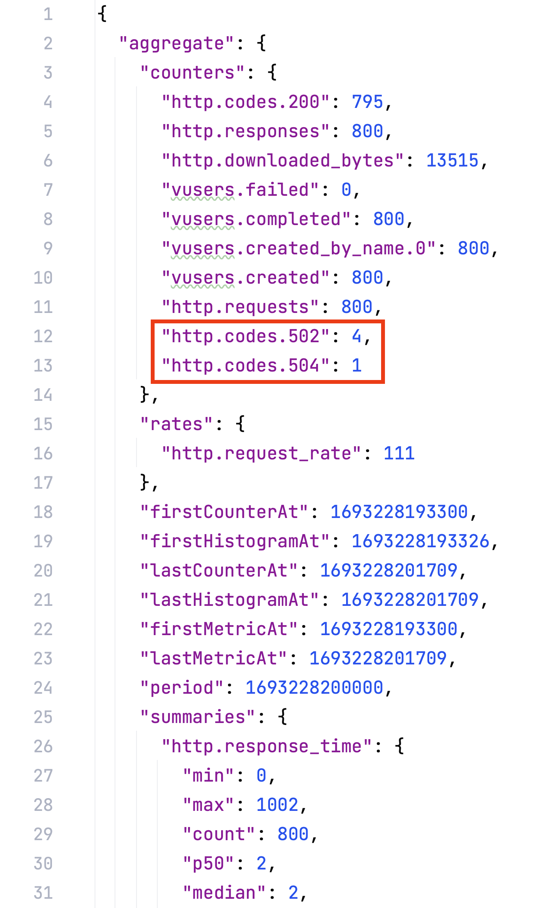
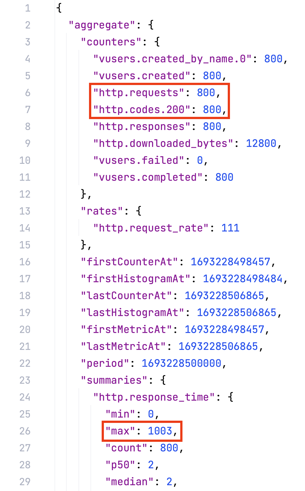

# Zero downtime deployment with docker compose and nginx

This repository contains a demo of a possible zero downtime deployment implementation with docker compose and nginx.  
The approach taken is heavily inspired by this article: https://www.tines.com/blog/simple-zero-downtime-deploys-with-nginx-and-docker-compose  

## Why this approach?

The caveat with the implementation outlined in the article from above is, that it did not produce a true zero downtime deployment.  
When running a load test with enough requests per second, you could measure a time window of a few milliseconds where requests will be answered with a 502 http error (or a 504 if the connection timeout is reached):  

  
I suppose that is because there is a short time window between stopping the old container and reloading the nginx config.  
During that time window, nginx is still trying to forward requests to the stopped container.  
Only when the nginx config has been reloaded, the stopped container is removed from the list of possible targets to forward requests to.
  
On the other hand the load test result of a true zero downtime deployment looks like this:
  
You can see that all 800 requests have been answered with a status code of 200.  
Furthermore the maximum response time is at 1003 milliseconds. We will come to that later.

## How does it work

A prerequisite for this approach to work is to duplicate the compose service that should be deployed with zero downtime.  
In our example compose project that is the `app` service. The duplicate gets the name `app_backup`.  
The service names have to be put in the corresponding variables in the `deploy.sh` script.  
Also the name of the nginx service has to be put into the reload_nginx function, which is `web` in our case.
```shell
reload_nginx() {
    docker compose exec web nginx -s reload
}

zero_downtime_deploy() {
    SERVICE=app
    BACKUP_SERVICE=app_backup
    
...
```
What is left is the nginx configuration.  
There are two things in the nginx config that make this approach work.  
The most important one is the upstream context combined with the `fastcgi_pass` directive (substitute [`fastcgi_pass`](http://nginx.org/en/docs/http/ngx_http_fastcgi_module.html#fastcgi_pass) with [`proxy_pass`](http://nginx.org/en/docs/http/ngx_http_proxy_module.html#proxy_pass) if you are not using a fastcgi server).  
Inside the upstream directive we are providing two servers for nginx to chose from. One of the is defined as a backup server.  
That means nginx will only proxy requests to it when the primary server(s) are unreachable.  
```nginx configuration
upstream php-fpm {
    server app:9000;
    server app_backup:9000 backup;
}

server {
    ...
    location ~ \.php$ {
        ...
        fastcgi_pass php-fpm;
        ...
    }
    ...
}
```
The second directive that makes switching from the primary server to the backup server relatively seamless is the `fastcgi_connect_timeout` directive. (substitute [`fastcgi_connect_timeout`](http://nginx.org/en/docs/http/ngx_http_fastcgi_module.html#fastcgi_connect_timeout) with [`proxy_connect_timeout`](http://nginx.org/en/docs/http/ngx_http_proxy_module.html#proxy_connect_timeout) if you are not forwarding to a fastcgi server)  
This directive is responsible for the maximum response time of 1003 milliseconds in the screenshot from above.  
It tells nginx to try to establish a connection within one second.  
If a connection could not be established within the specified timeframe nginx will try the next server in the upstream context. Which is the backup server in our case.  
However the long response time of one second will only happen to the first request hitting nginx after the primary server is no longer available. From that point onward all requests will be proxied to the backup server.  
Only after the time passed defined by the [`fail_timeout`](https://nginx.org/en/docs/http/ngx_http_upstream_module.html#fail_timeout) directive (default to 10s), will nginx check if the server is reachable again and the next request will experience a response time of at least 1 second again. Which in our example is irrelevant because by then the nginx config is reloaded and the stopped container is no longer used by nginx to forward requests to.
``` nginx configuration
server {
    ...
    location ~ \.php$ {
        ...
        fastcgi_connect_timeout 1s;
        ...
    }
    ...
}
```

## Test it yourself

The `execute-deployment.sh` script will start the docker compose project and the load test.  
It will then update the image to be used by docker compose and execute the `deploy.sh` script.  
The result od the load test will be stored in the same directory in the file `load-test-report.json`  
In order for the load test to work, you have to install artillery first: https://github.com/artilleryio/artillery